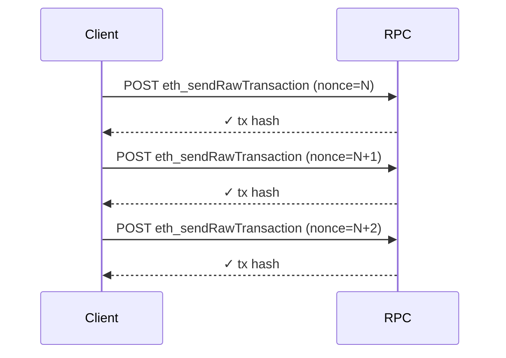
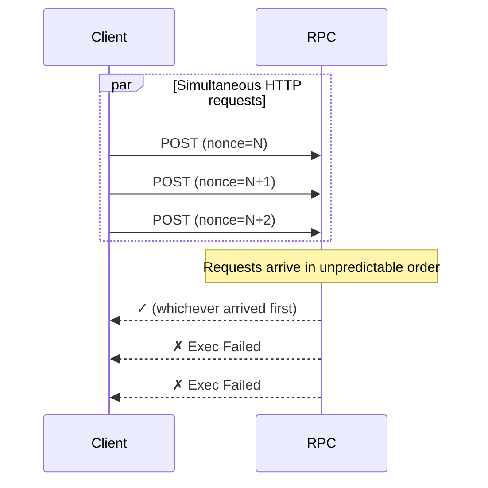
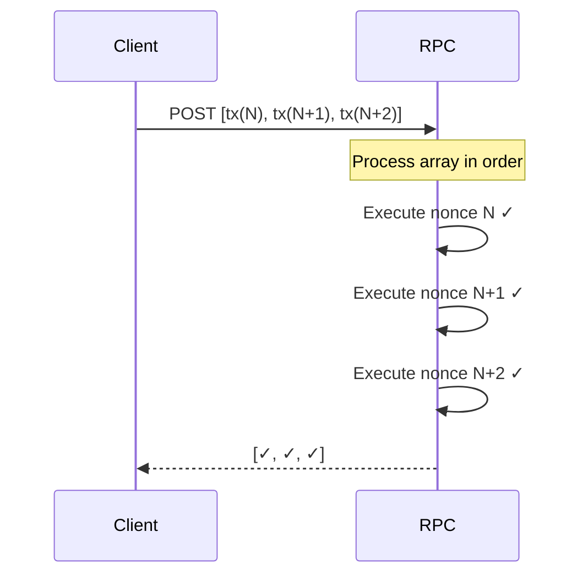
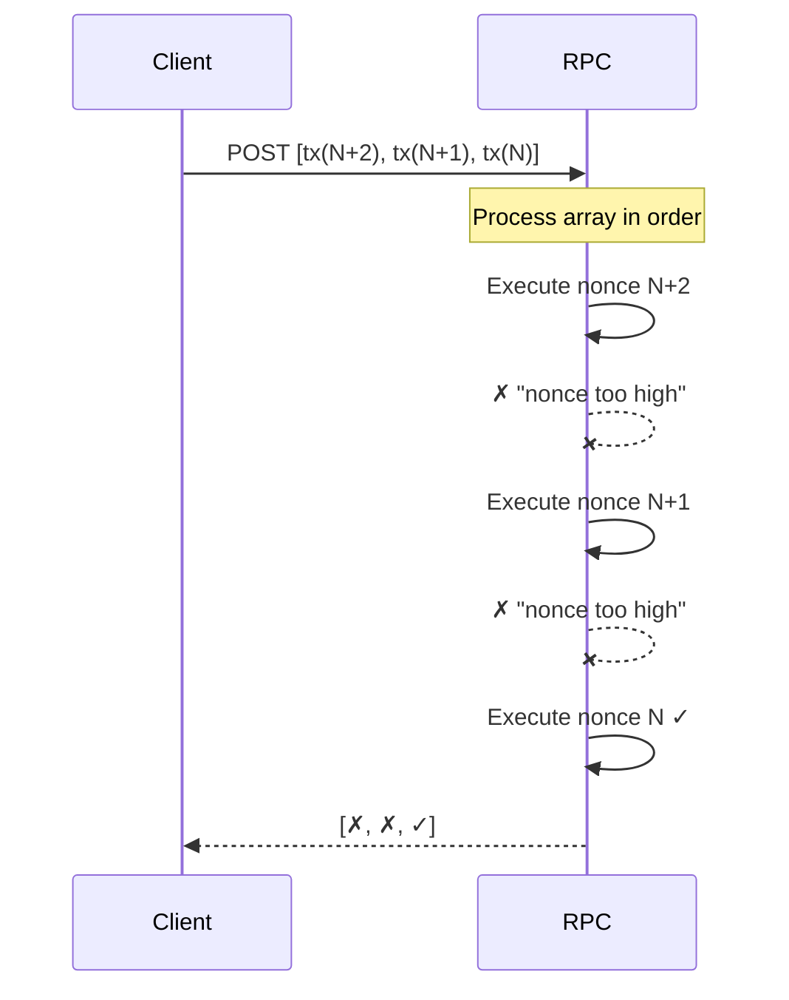
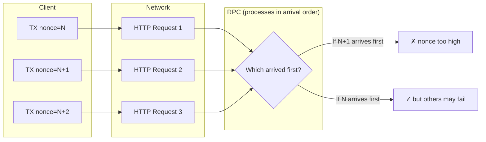
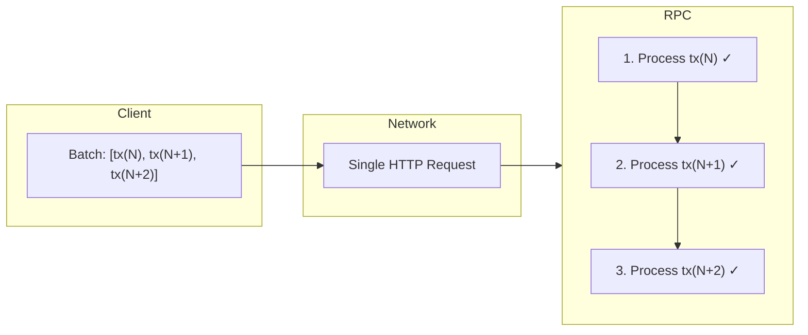

# Radius Testnet RPC Behavior Analysis

**Date:** 2026-01-18
**RPC:** `https://rpc.testnet.radiustech.xyz`
**Chain ID:** 1223953

---

## TL;DR for Developers

Radius does not have a traditional mempool that queues future-nonce transactions. Transactions must arrive at the RPC in nonce order.

```typescript
import { createRadiusClient } from '@radiustechsystems/sdk';
import { radiusTestnet } from '@radiustechsystems/sdk/chains';
import { privateKeyToAccount } from 'viem/accounts';

const client = createRadiusClient({ chain: radiusTestnet });
const signer = privateKeyToAccount('0x...');

// ✅ Single transaction - works normally
await client.sendTransaction(signer, { to, value });

// ✅ Multiple transactions - sequential (simple, always works)
for (const tx of transactions) {
  await client.sendTransaction(signer, tx);
}

// ✅ Multiple transactions - batch helper (fastest, recommended)
const hashes = await client.sendTransactionBatch(signer, [
  { to: addr1, value: 1n },
  { to: addr2, value: 2n },
  { to: addr3, value: 3n },
]);

// ❌ DON'T - parallel individual requests fail ~50% of the time
await Promise.all(txs.map(tx => client.sendTransaction(signer, tx)));
```

---

## Executive Summary

The Radius testnet RPC has specific transaction submission requirements that differ from standard Ethereum. Key findings:

| Submission Method | Success Rate | Recommended |
|-------------------|--------------|-------------|
| Sequential (await each) | **100%** | ✅ Simple, always works |
| `sendTransactionBatch()` | **100%** | ✅ Best for throughput |
| Parallel individual HTTP requests | **~50%** | ❌ Unreliable |

**The SDK provides `sendTransactionBatch()` to handle nonce ordering and JSON-RPC batching automatically.**

---

## How Transaction Submission Works

### Method 1: Sequential (Baseline)

```typescript
// Each transaction completes before the next is sent
for (const tx of transactions) {
  await client.sendTransaction(tx);
}
```



**Result: 100% success** — Transactions are processed one at a time in order.

---

### Method 2: Parallel Individual HTTP Requests

```typescript
// Multiple HTTP requests fired simultaneously
await Promise.all([
  client.sendTransaction({ nonce: N }),
  client.sendTransaction({ nonce: N+1 }),
  client.sendTransaction({ nonce: N+2 }),
]);
```



**Result: ~50% success** — Network timing causes requests to arrive out of order. The RPC rejects transactions with nonces higher than current.

---

### Method 3: JSON-RPC Batch (Single HTTP Request)

```typescript
// Single HTTP request containing multiple transactions
const batch = [
  { jsonrpc: "2.0", id: 1, method: "eth_sendRawTransaction", params: [signedTx1] },
  { jsonrpc: "2.0", id: 2, method: "eth_sendRawTransaction", params: [signedTx2] },
  { jsonrpc: "2.0", id: 3, method: "eth_sendRawTransaction", params: [signedTx3] },
];
await fetch(RPC_URL, { method: 'POST', body: JSON.stringify(batch) });
```



**Result: 100% success** — All transactions arrive in a single request. The RPC processes them in array order.

---

### Method 4: JSON-RPC Batch (Wrong Order)

```typescript
// Batch with transactions in REVERSE nonce order
const batch = [
  { ..., params: [signedTx_N2] },  // nonce N+2 first
  { ..., params: [signedTx_N1] },  // nonce N+1 second
  { ..., params: [signedTx_N] },   // nonce N last
];
```



**Result: ~33% success** — Only the correct nonce succeeds. Future nonces are rejected immediately with "nonce too high".

---

## Root Cause Analysis

### Why Parallel Individual Requests Fail



**The RPC does not queue future nonces.** If nonce N+1 arrives before N is processed, it's rejected immediately.

### Why JSON-RPC Batch Works



**All transactions arrive together and are processed in array order.** No network timing issues.

---

## Comparison with Standard Ethereum

| Behavior | Standard Ethereum | Radius Testnet |
|----------|-------------------|----------------|
| Parallel HTTP requests | ✅ Works (mempool queues) | ❌ ~50% fail |
| Future nonce handling | Queued in mempool | Rejected immediately |
| JSON-RPC batch | ✅ Works | ✅ Works (must be ordered) |
| Gas price | Market-based | 0 (free) |
| Gas on rejection | Sometimes charged | Never charged |

### Standard Ethereum Mempool Behavior

On Ethereum mainnet, future-nonce transactions are held in a "queued" pool:

```
Submit nonce N+2 → queued (waiting for N, N+1)
Submit nonce N+1 → queued (waiting for N)
Submit nonce N   → pending → executes
                 → N+1 moves to pending → executes
                 → N+2 moves to pending → executes
```

### Radius Testnet Behavior

No queuing. Future nonces are rejected immediately:

```
Submit nonce N+2 → ✗ "nonce too high" (rejected)
Submit nonce N+1 → ✗ "nonce too high" (rejected)
Submit nonce N   → ✓ executes
```

---

## Recommendations

### For SDK Users

```typescript
// ❌ DON'T: Parallel individual requests (fails ~50% of the time)
await Promise.all(txs.map(tx => client.sendTransaction(signer, tx)));

// ✅ DO: Sequential submission (simple, always works)
for (const tx of transactions) {
  await client.sendTransaction(signer, tx);
}

// ✅ DO: Batch helper (fastest, recommended for multiple transactions)
const hashes = await client.sendTransactionBatch(signer, [
  { to: addr1, value: 1n },
  { to: addr2, data: swapData },
  { to: addr3, value: 3n },
]);
```

### How `sendTransactionBatch` Works Internally

The batch helper handles JSON-RPC batching automatically:

1. Fetches current nonce once
2. Signs all transactions with sequential nonces (N, N+1, N+2...)
3. Sends single HTTP POST with JSON-RPC batch array
4. Returns array of transaction hashes

```typescript
// Internal implementation (handled by the SDK)
const batch = signedTxs.map((raw, i) => ({
  jsonrpc: '2.0',
  id: i,
  method: 'eth_sendRawTransaction',
  params: [raw],
}));
await fetch(RPC_URL, { method: 'POST', body: JSON.stringify(batch) });
```

---

## Test Results

### Run 1 (2026-01-18)

| Test | Run 1 | Run 2 | Run 3 | Average |
|------|-------|-------|-------|---------|
| Sequential | 3/3 ✓ | 3/3 ✓ | 3/3 ✓ | **100%** |
| Parallel Individual | 2/3 | 1/3 | 2/3 | **56%** |
| JSON-RPC Batch | 3/3 ✓ | 3/3 ✓ | 3/3 ✓ | **100%** |
| Batch (Reverse) | 1/3 | 1/3 | 1/3 | **33%** |

### Error Messages Observed

| Scenario | Error |
|----------|-------|
| Parallel request rejected | `Exec Failed` |
| Future nonce in batch | `nonce X too high` |
| Duplicate nonce | `nonce X already used` |

---

## Gas Consumption

**Failed transactions do NOT consume gas.** Rejections happen pre-execution.

| Metric | Value |
|--------|-------|
| Gas price on testnet | **0** (free) |
| Balance change on failure | None |
| Nonce increment on failure | No |

---

## Files

| File | Description |
|------|-------------|
| `rpc-behavior-test.ts` | Comprehensive test script |
| `rpc-behavior-results.json` | Raw test results |
| `timing-discovery.ts` | Earlier timing tests |
| `gas-consumption-test.ts` | Gas/nonce analysis |

---

## Reproduction

```bash
cd /path/to/radius-sdk/typescript
RADIUS_PRIVATE_KEY=0x... npx tsx research/rpc-behavior-test.ts
```

---

## Conclusion

The Radius testnet RPC requires transactions to be submitted in nonce order. While this differs from standard Ethereum (which queues future nonces), the SDK provides a reliable solution.

**Key takeaway:** Use `sendTransactionBatch()` for multiple transactions — it handles nonce ordering and JSON-RPC batching automatically, achieving 100% reliable submission with optimal throughput.
