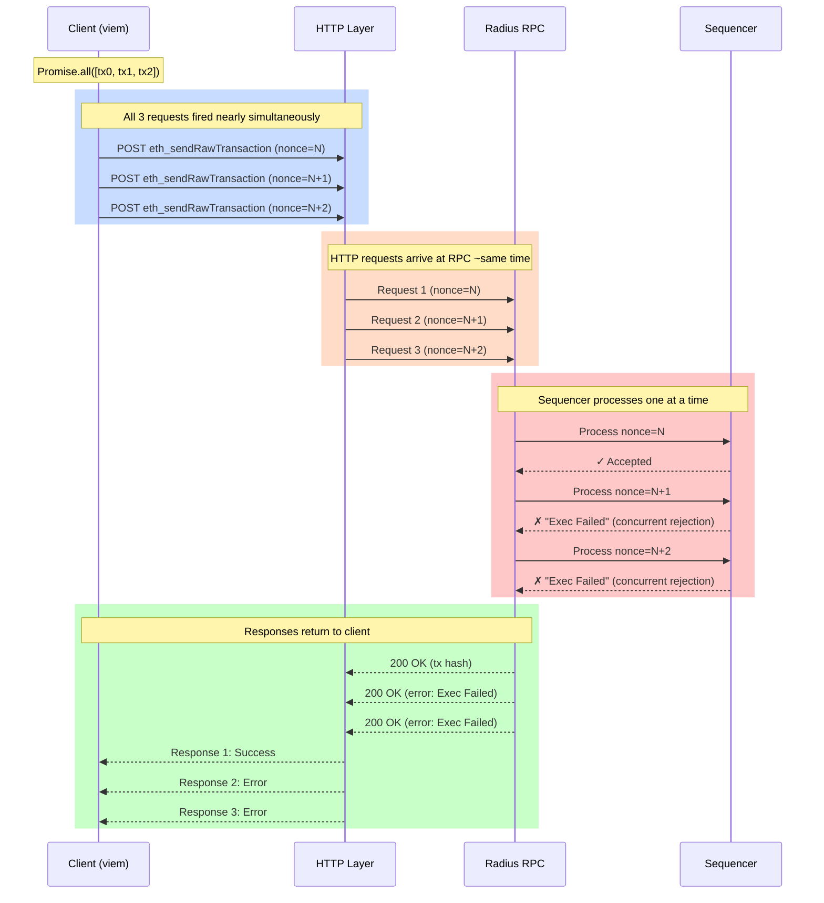
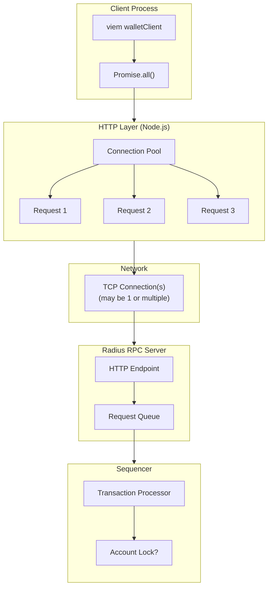
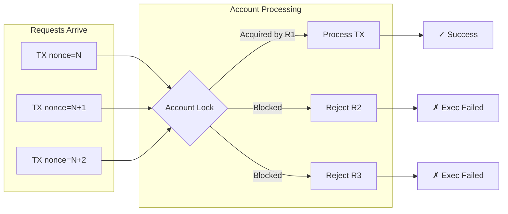

# Parallel Transaction Submission - RPC Level Analysis

## Sequence Diagram



## HTTP Connection Details



## What We're Sending

Each HTTP request looks like:

```http
POST / HTTP/1.1
Host: rpc.testnet.radiustech.xyz
Content-Type: application/json

{
  "jsonrpc": "2.0",
  "id": 1,
  "method": "eth_sendRawTransaction",
  "params": ["0x02f867...signed_tx_bytes..."]
}
```

## Key Observations

### At the Client Level
- `Promise.all()` fires all requests without waiting
- Each `sendTransaction` is a separate HTTP POST
- No client-side batching (JSON-RPC batch) - individual requests

### At the HTTP Level
- Node.js HTTP client uses connection pooling
- May reuse TCP connections (keep-alive)
- Requests are truly concurrent from client perspective

### At the RPC Level
- All requests arrive ~simultaneously
- RPC must decide ordering
- Sequencer appears to have per-account locking

### Hypothesis: Why Failures Occur



The sequencer likely acquires a lock per account during transaction processing.
Any concurrent requests for the same account are rejected rather than queued.

## Alternative: JSON-RPC Batch Request

We could test if batching changes behavior:

```http
POST / HTTP/1.1
Content-Type: application/json

[
  {"jsonrpc":"2.0","id":1,"method":"eth_sendRawTransaction","params":["0x...tx1"]},
  {"jsonrpc":"2.0","id":2,"method":"eth_sendRawTransaction","params":["0x...tx2"]},
  {"jsonrpc":"2.0","id":3,"method":"eth_sendRawTransaction","params":["0x...tx3"]}
]
```

This sends all transactions in a single HTTP request. The RPC server would then
process them - potentially in order within the batch.
